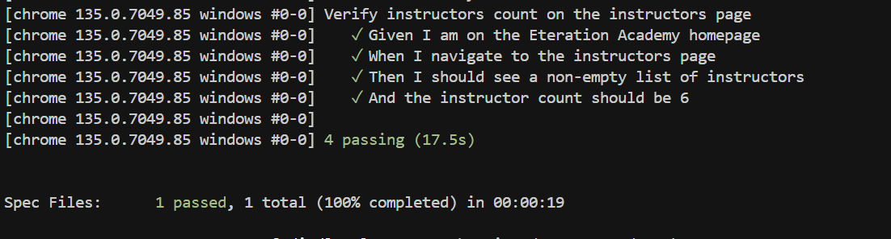

# Eteration Automation Test Case

**Note:** Zamanım olmadığı için istenilen durumları en temel hali ile tamamladım. Zamanım olsaydı daha profesyonel yapılar çıkartabilirdim.

## Overview

This repository contains automated tests for Eteration Academy website using WebdriverIO and Cucumber. The tests are designed to verify key functionality of the website, such as navigation and instructor verification.

## Project Structure

```
eteration-automation/
├── features/
│   ├── check-instructors.feature      # Cucumber feature file
│   ├── pageobjects/                   # Page Object Model implementation
│   │   ├── home.page.js               # Home page object
│   │   ├── instructors.page.js        # Instructors page object
│   │   └── index.js                   # Page objects index
│   └── step-definitions/              # Cucumber step definitions
│       └── instructors.steps.js       # Implementation of test steps
├── pictures/                          # Test results and screenshots
│   └── result.png                     # Test execution results
└── wdio.conf.js                       # WebdriverIO configuration
```

## Test Cases

The current test suite verifies:

1. Navigation to the Eteration Academy website
2. Navigation to the Instructors page
3. Verification that the instructor list is not empty
4. Verification that the instructor count is 6

## Test Results

Below is a screenshot of the test execution results:



## How to Run Tests

1. Install dependencies:
```bash
npm install
```

2. Run tests:
```bash
npx wdio
```

## Technologies Used

- WebdriverIO
- Cucumber.js
- Page Object Model pattern
- JavaScript

## Future Improvements

With more time, the following improvements could be made:

- Add more comprehensive test coverage for other pages
- Implement reporting with better visualization
- Add CI/CD integration
- Add parallel test execution capability
- Improve error handling and recovery scenarios 